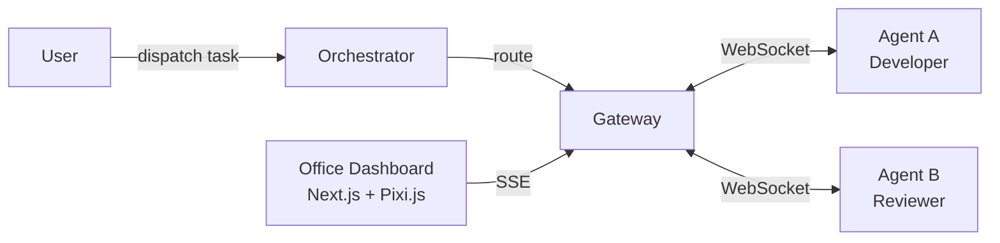

```
  /\_/\   ___  ____  ____  _  _  ___  __      __   _    _
 ( o.o ) / _ \|  _ \| ___|| \| |/ __||  |    /  \ | |  | |
  > ^ <  | (_) | |_) | |_  | .` | (__ | |_  | () || |__| |
  |   |   \___/|____/|___| |_|\_|\___||___|  \__/ |____|__|

        🦀  Multi-Agent AI Collaboration Framework
```

# OpenClaw

OpenClaw is an open-source **multi-agent AI collaboration framework** that lets you build, connect, and orchestrate AI agents over WebSockets. It ships with a **Pokemon pixel-art virtual office dashboard** so you can watch your agents work in real time.

---

## Architecture



---

## Package Overview

| Package / App          | Description                              |
|------------------------|------------------------------------------|
| `packages/core`        | Shared types, logger, errors             |
| `packages/gateway`     | WebSocket gateway + SSE + REST server    |
| `packages/orchestrator`| Task routing, round-robin, retries       |
| `packages/sdk`         | `OpenClawAgent` base class for agents    |
| `apps/office`          | 🎮 Pokemon pixel-art office dashboard   |
| `apps/example`         | Demo: two agents run a task end-to-end   |

---

## 🎮 Pixel Art Office

The `apps/office` dashboard renders your agent network as a **Pokemon Gen 1/2 style virtual office**:

- **160×144 GBA-native canvas** scaled 4× with `image-rendering: pixelated`
- Each agent has a **colored pixel sprite** (Charmander-red orchestrators, Squirtle-blue developers…)
- **Envelope animations** fly between agents when tasks are delegated
- **State bubbles**: `...` thinking, `>>>` working, ⭐ success, `?` error, `ZZZ` offline
- **Celebration animation**: confetti + all agents jump on task completion


---

## Quick Start

### Backend

```bash
# 1. Install dependencies
pnpm install

# 2. Copy env
cp .env.example .env.local

# 3. Start gateway (port 18789)
pnpm --filter gateway dev

# 4. Run demo (in a second terminal)
pnpm --filter example dev
```

### Frontend (Office Dashboard)

```bash
# Start the pixel art office (port 3000)
pnpm --filter office dev
```

Open [http://localhost:3000](http://localhost:3000) — you'll see the office canvas. Run the example demo and watch agents appear and trade tasks.

---

## Configuration

All config is via environment variables (see `.env.example`):

| Variable                             | Default                          | Description                       |
|--------------------------------------|----------------------------------|-----------------------------------|
| `OPENCLAW_GATEWAY_PORT`              | `18789`                          | Gateway WebSocket + HTTP port     |
| `OPENCLAW_GATEWAY_TOKEN`             | —                                | Bearer token for auth             |
| `OPENCLAW_GATEWAY_URL`               | `ws://127.0.0.1:18789`           | Gateway URL for agents            |
| `OPENCLAW_ORCHESTRATOR_TIMEOUT_MS`   | `30000`                          | Task timeout in milliseconds      |
| `OPENCLAW_ORCHESTRATOR_MAX_RETRIES`  | `3`                              | Max task retry attempts           |
| `LOG_LEVEL`                          | `info`                           | Pino log level                    |
| `NEXT_PUBLIC_GATEWAY_SSE_URL`        | `http://localhost:18789/events`  | SSE URL for the office frontend   |
| `NEXT_PUBLIC_OFFICE_SCALE`           | `4`                              | Canvas pixel scale factor         |

---

## Building a Custom Agent

```typescript
import { OpenClawAgent } from '@openclaw/sdk'
import type { Task } from '@openclaw/core'

class MyAgent extends OpenClawAgent {
  readonly role = 'developer' as const
  readonly capabilities = ['typescript', 'testing']

  async handle(task: Task): Promise<unknown> {
    // Your logic here
    return { result: 'done' }
  }
}

const agent = new MyAgent({ name: 'My-Agent-1' })
agent.start()
```

---

## Roadmap

| Version | Goals |
|---------|-------|
| **v0.1** | Core Gateway + Orchestrator + SDK + Pixel Art Office (placeholders) |
| **v0.2** | Real pixel art sprites, tile editor, multi-room office |
| **v1.0** | AI-generated office scenes, plugin marketplace, cloud deploy |

---

## Contributing

See [CONTRIBUTING.md](CONTRIBUTING.md). We welcome PRs for:
- New agent roles and sprite designs
- Orchestrator strategies (priority queue, capability matching)
- Office tile/sprite improvements

---

## License

MIT — see [LICENSE](LICENSE).
